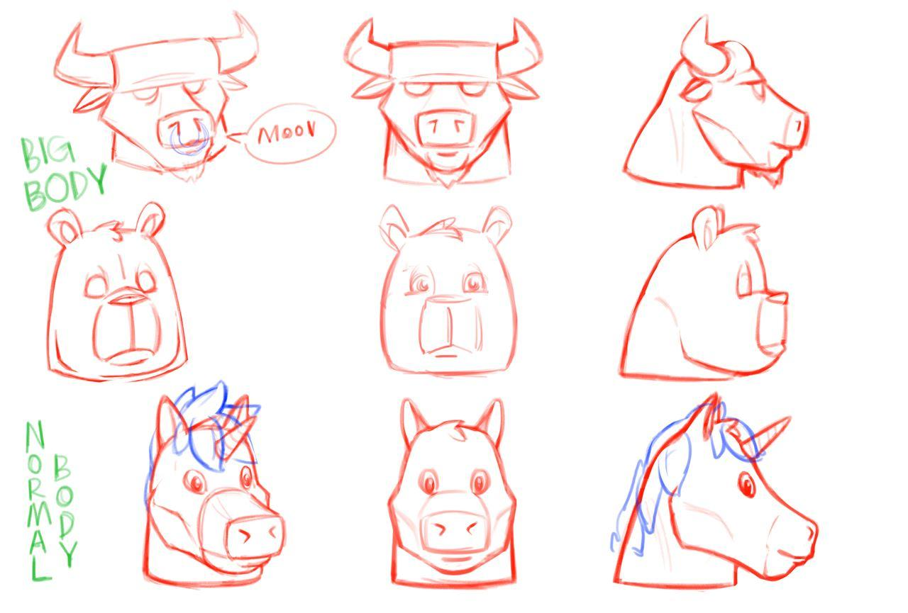
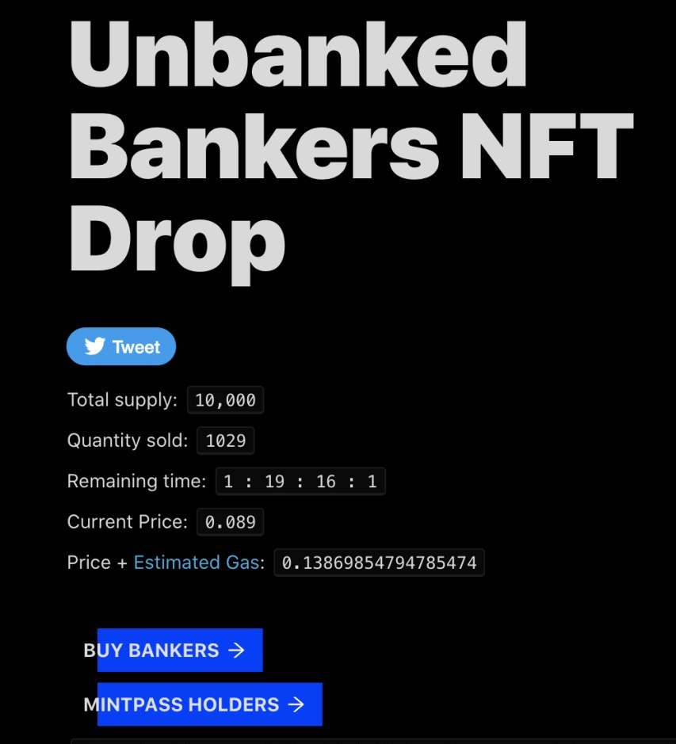
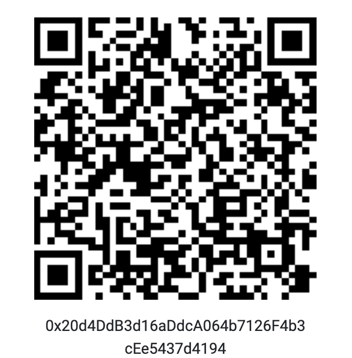

<!-- PROJECT LOGO -->
# `Unbanked` from `Ternio`

<p align="center"></p>

<!-- ABOUT THE PROJECT -->
# Bankers Smart Contract

Welcome to the Bankers smart contract repository. 
This README provides a comprehensive overview of the Bankers collection, its utilities, and how to get started with the contract.

## Overview

### Bankers Collection

The Bankers collection comprises unique digital collectibles on the Ethereum blockchain that offer real utility and ownership benefits:

- **Increased Earnings**: Earn 20% more on Unbanked Yield.
- **Lending and Borrowing**: Enjoy free lending and borrowing services.
- **Creator Background**: Created by Antoine Mingo, the creator of Pudgy Penguins.
- **IP Rights**: Full ownership of your Banker IP rights.
- **Limited Edition**: Out of the 10,000 originally created, only 1,932 remain as the unsold Bankers were burned.


### Dutch Auction Contract

The Bankers contract operates as a Dutch auction. In a Dutch auction, the price of the token starts high and decreases over time until a buyer is willing to purchase at the current price. This mechanism ensures that tokens are sold at a fair market value based on demand.

### MintPass

<p align="center"></p>

The MintPass was a pre-launch initiative designed to allow early supporters to get whitelisted for the Bankers collection. By acquiring a MintPass, users secured their spot in the whitelist, granting them early access to mint Bankers NFTs before the public sale. This not only guaranteed participation but also offered benefits such as reduced minting costs and early bird bonuses.

How it Worked:

* **Acquisition**: Users could obtain MintPasses through various pre-launch activities, promotions, or by purchasing directly during the pre-sale period.
* **Whitelist Access**: Holding a MintPass automatically whitelisted the user for the main launch, ensuring they could mint their NFTs ahead of others.
* **Exclusive Benefits**: MintPass holders enjoyed perks such as lower minting fees and exclusive early access to rare Bankers NFTs.

### User Interface

<p align="center"></p>

The user interface for interacting with the Bankers smart contract is built using a `scaffold-eth`. More information could be found in the [GitHub Repository](https://github.com/scaffold-eth/scaffold-eth):

> 🧪 An open-source, up-to-date toolkit for building decentralized applications (dapps) on the Ethereum blockchain. It's designed to make it easier for developers to create and deploy smart contracts and build user interfaces that interact with those contracts.

Built using `NextJS`, `RainbowKit`, `Hardhat`, `Wagmi`, `Viem`, and `Typescript`.
- **Contract Hot Reload**: Your frontend auto-adapts to your smart contract as you edit it.
- **[Custom hooks](https://docs.scaffoldeth.io/hooks/)**: Collection of React hooks wrapper around [wagmi](https://wagmi.sh/) to simplify interactions with smart contracts with typescript autocompletion.
- [**Components**](https://docs.scaffoldeth.io/components/): Collection of common web3 components to quickly build your frontend.
- **Burner Wallet & Local Faucet**: Quickly test your application with a burner wallet and local faucet.
- **Integration with Wallet Providers**: Connect to different wallet providers and interact with the Ethereum network.
  
> [!WARNING]
> `Scafold-eth` has been archived and is now read-only. [`Scaffold-ETH 2`](https://github.com/scaffold-eth/scaffold-eth-2) is the latest version.

## Unbanked Yield

### What is Yield Farming?

Yield farming involves utilizing digital assets to maximize returns. It typically entails locking up digital assets in various DeFi protocols to earn rewards. Yield farming, also known as liquidity mining, can involve moving assets across different pools to achieve the best annual percentage yield (APY).

### Unbanked Yield on Uniswap

Given the surge in Ethereum-based DeFi protocols, Unbanked Yield leverages Uniswap for yield farming. Uniswap offers a decentralized platform for automated liquidity provision for Ethereum token trading pairs.

### Tokenization with TERN

Ternio has introduced TERN tokens to Uniswap for liquidity pooling. As an ERC-20 token, TERN can be deposited into a smart contract to receive pool tokens, which represent the provider’s share of the liquidity pool. Uniswap charges a 0.30% fee on all trades, which is added to the reserve pool and distributed to liquidity providers when they reclaim their stakes by burning pool tokens.

## Getting Started

To interact with the Bankers NFT smart contract, follow these steps:

1. **View Accounts**:
    ```sh
    $ npx hardhat accounts
    ```

2. **Compile the Contract**:
    ```sh
    $ npx hardhat compile
    ```

3. **Clean the Cache**:
    ```sh
    $ npx hardhat clean
    ```

4. **Run Tests**:
    ```sh
    $ npx hardhat test
    ```

5. **Start a Local Node**:
    ```sh
    $ npx hardhat node
    ```

6. **Execute Sample Script**:
    ```sh
    $ node scripts/sample-script.js
    ```

7. **Get Help**:
    ```sh
    $ npx hardhat help
    ```

## License

This project is distributed under the BSD-3 License. See [LICENSE](LICENSE.txt) for more information.

## Etherscan

| Contract | Etherscan Link | QR Code |
|----------|-----------------|---------|
| MintPass | [View on Etherscan](https://etherscan.io/address/0x20d4ddb3d16addca064b7126f4b3cee5437d4194) |  |
| Bankers  | [View on Etherscan](https://etherscan.io/address/0x95f36f45d93e5271612e4fd365fa9c2ac165a3fc) |  |