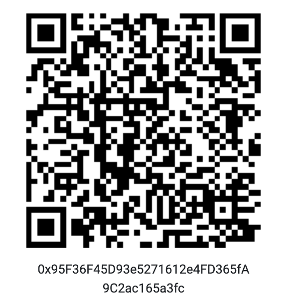

<!-- PROJECT LOGO -->
# `Unbanked` from `Ternio`

<p align="center"></p>

<!-- ABOUT THE PROJECT -->
## Smart Contract

`Bankers` collectibles on the Ethereum blockchain. The `Bankers` NFT collection are unique collectibles which provide real utility and ownership:

* Get 20% more earnings on `Unbanked` Yield
* Free NFT lending and borrowing
* `Bankers` were created by `Antoine Mingo` who also created `Pudgy Penguins`
* You own your `Banker` IP rights
* Limited edition as all unsold `Bankers` were burned (1,932 remain of 10,000 created)

### `Unbanked` Yield

With the recent growth of new Ethereum based protocols in DeFi, we’re seeing an exploding trend of users being able to share in the upside of the protocol’s growth. One of the initiatives turning a lot of heads is Yield Farming, specifically on `Uniswap`.  

#### What is Yield Farming?

Yield farming is categorized as any effort to put crypto assets to work in order to “farm” the most “yield” from those assets. In simple terms, it is locking up your digital assets and getting rewards for it. A yield farmer may move assets around within DeFi protocols like `Compound`, in order to find whichever pool is offering the best APY from week to week. Yield farming may also be referred to as liquidity mining. This strategy has worked well for many Defi projects and has brought some of the best results in terms of pools of the liquidity.

#### Tokenization

Looking at the growing demand of yield-farming, `Ternio` has also jumped on the bandwagon by adding `TERN` (`Ternio` token) to `Uniswap` for the liquidity pool yield. `Uniswap`’s user-friendly platform offers a decentralized protocol for automated liquidity provision for Ethereum token trading pairs. Since `TERN` is an `ERC-20` token, anyone can become a liquidity provider by depositing `TERN` tokens into a smart contract and receiving pool tokens in return. These pool tokens keep track of the providers’ share in the liquidity pool and can be traded in for the underlying asset at any time. `Uniswap` charges a 0.30% transaction fee on all trades, which is added to the reserve pool. The total fee accumulated will be distributed to the liquidity providers when they reclaim their stakes by burning their pool tokens. 

<!-- USAGE EXAMPLES -->
## Getting Started

```shell
$ npx hardhat accounts
$ npx hardhat compile
$ npx hardhat clean
$ npx hardhat test
$ npx hardhat node
$ node scripts/sample-script.js
$ npx hardhat help
```

<!-- LICENSE -->
## License

Distributed under the BSD-3 License. See `LICENSE.txt` for more information.

## Etherscan

<a href="https://etherscan.io/address/0x95f36f45d93e5271612e4fd365fa9c2ac165a3fc">Contract</a> `0x95F36F45D93e5271612e4FD365fA9C2ac165a3fc`

<p align="left">
    <a href="https://etherscan.io/address/0x95f36f45d93e5271612e4fd365fa9c2ac165a3fc">
        
    </a>
</p>

